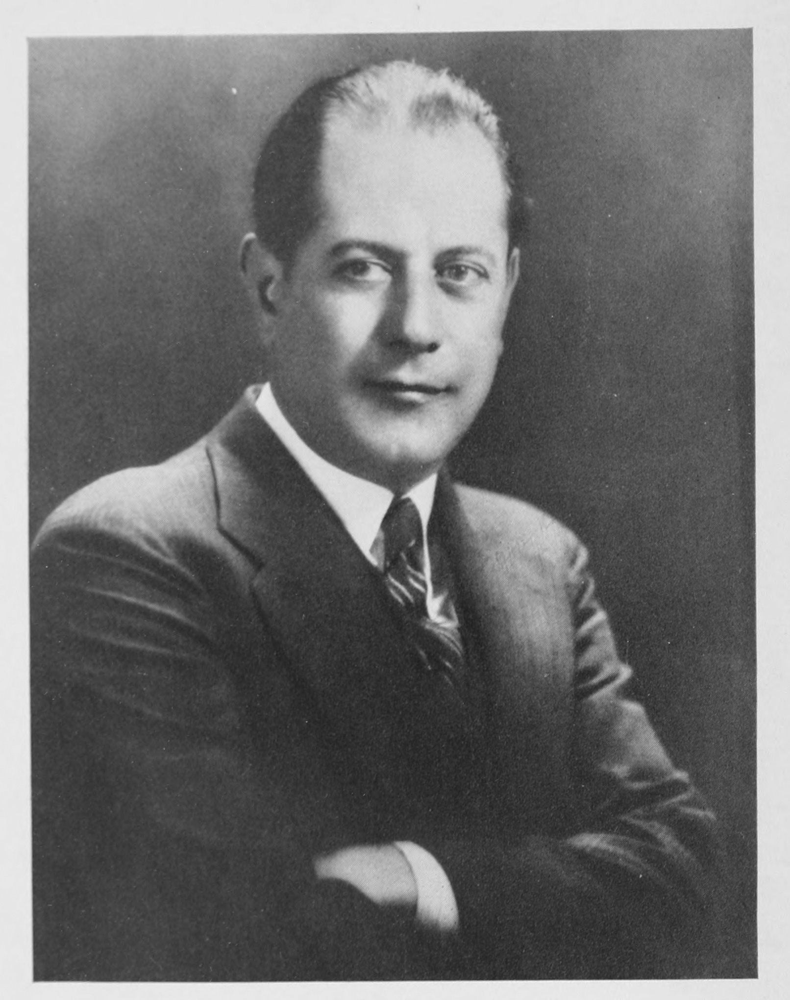

# Fundamentos del Ajedrez

**Por José Raúl Capablanca y Graupera, 1921**

Escrito originalmente en inglés con el título "Chess Fundamentals".

Traducción directa de: ENRIQUE P. FALCÓN

Maquetación web: DEYBIS MELENDEZ VARGAS (Trabajo en proceso)

---



---



---



---



---



---



---



---



---



---



---



---



---



---



---



---



---



---



---



---



---



---